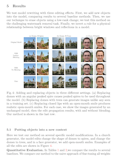
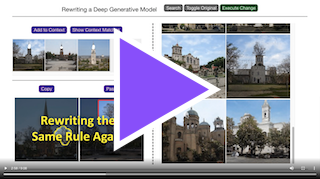
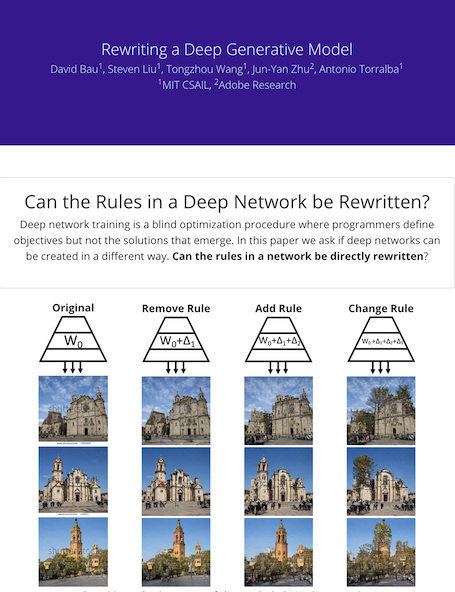
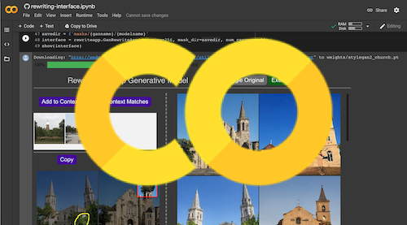
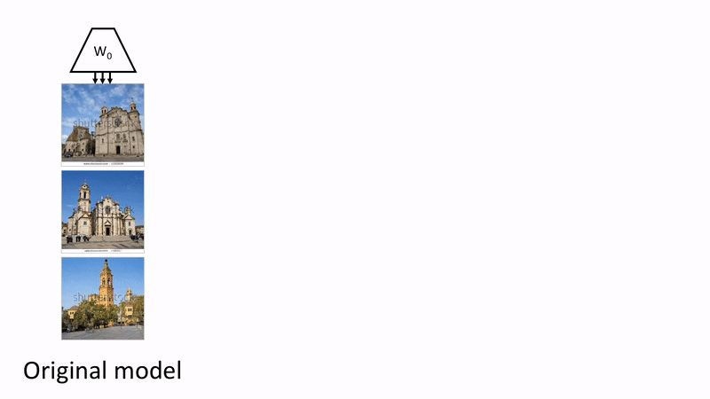
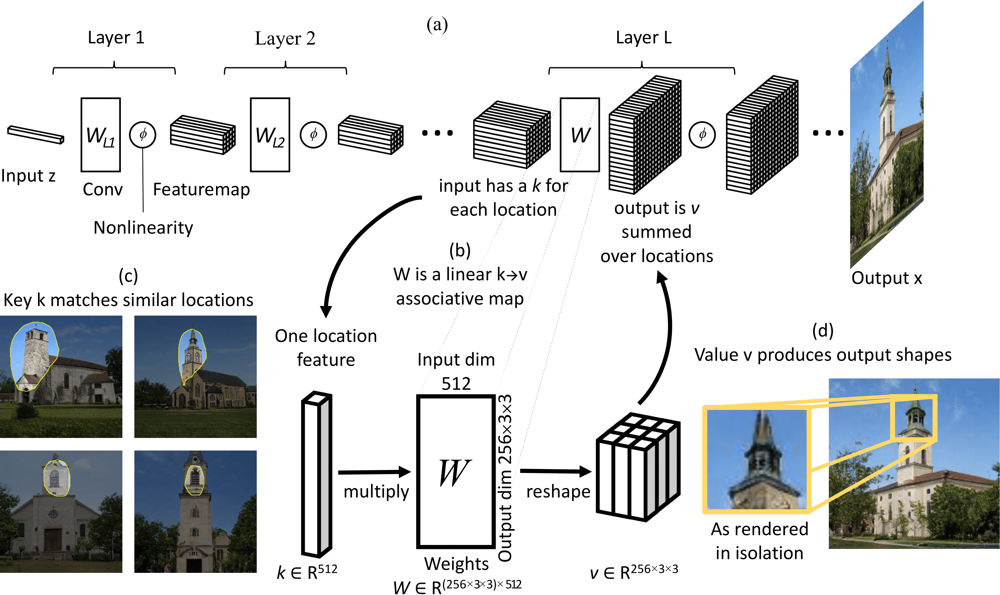
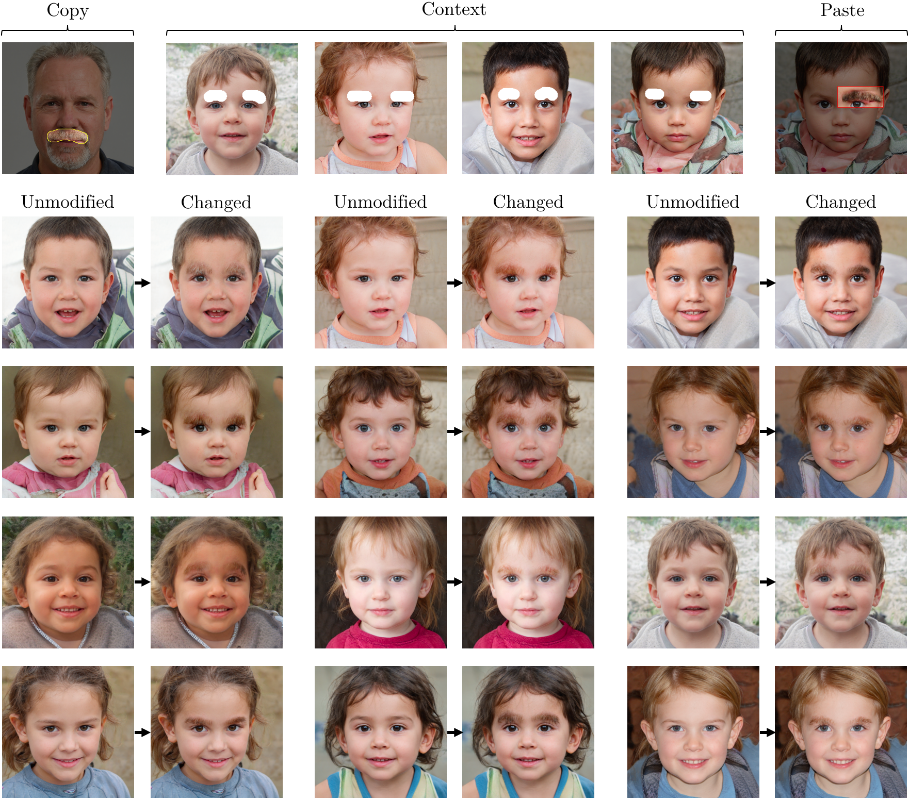
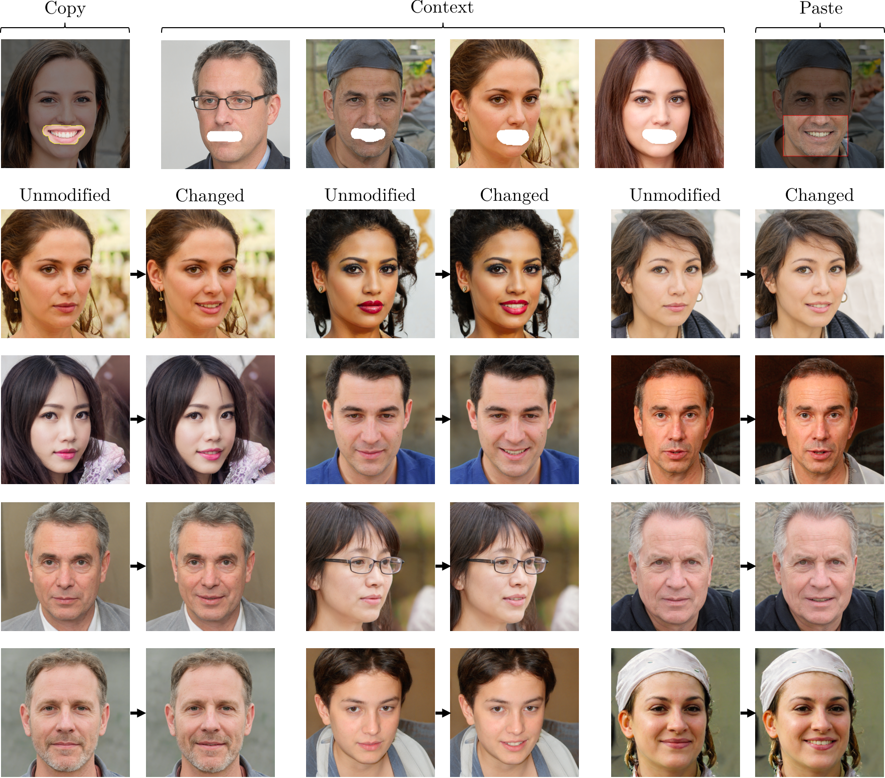

# Rewriting a Deep Generative Model

In this paper, we ask if a deep network can be reprogrammed to follow different rules, by enabling a user to directly change the weights, instead of training with a data set.


<table><tr><td><a href="http://rewriting.csail.mit.edu/"></a><br>
Directly rewriting the weights of a StyleGANv2 to reprogram horses to have hats.</td></tr></table>

### What is model rewriting?
We present the task of *model rewriting*, which aims to add, remove, and alter the semantic and physical rules of a pre-trained deep network.  While modern image editing tools achieve a user-specified goal by manipulating individual input images, we enable a user to synthesize an unbounded number of new images by editing a generative model to carry out modified rules.


### Why rewrite a model?
There are two reasons to want to rewrite a deep network directly:
  1. To gain insight about how a deep network organizes its knowledge.
  2. To enable creative users to quickly make novel models for which there is no existing data set.

Model rewriting envisions a way to construct deep networks according to a user's intentions. Rather than limiting networks to imitating data that we already have, rewriting allows deep networks to model a world that follows new rules that a user wishes to have.


[**Rewriting a Deep Generative Model**](https://rewriting.csail.mit.edu/).<br>
[David Bau](https://people.csail.mit.edu/davidbau/home/), [Steven Liu](http://people.csail.mit.edu/stevenliu/), [Tongzhou Wang](https://ssnl.github.io/), [Jun-Yan Zhu](http://people.csail.mit.edu/junyanz/), [Antonio Torralba](http://web.mit.edu/torralba/www/). <br>
ECCV 2020 (oral).<br>
MIT CSAIL and Adobe Research.

<table><tr><td><center><a href="https://rewriting.csail.mit.edu/paper/"><br>ECCV 2020<br>Preprint</a></center></td>
<td><center><a href="https://rewriting.csail.mit.edu/video/" class="d-inline-block p-3 align-bottom"><br>ECCV 2020<br>Talk Video</a></center></td>
<td><center><a href="https://rewriting.csail.mit.edu/" class="d-inline-block p-3 align-top"><br>Website</a></center></td>
<td><center><a href="https://colab.research.google.com/github/davidbau/rewriting/blob/master/notebooks/rewriting-interface.ipynb" class="d-inline-block p-3 align-bottom"><br>Demo Colab<br>Notebook</a></center></td></tr></table>



Our method rewrites the weights of a generator to change generative rules.
Instead of editing individual images, our method edits the generator, so an infinite set of images can be potentially synthesized and manipulated using the altered rules.  Rules can be changed in various ways, such as *removing* patterns such as watermarks, *adding* objects such as people, or *replacing* definitions such as making trees grow out of towers.



Our method is based on the hypothesis that the weights of a generator act as linear associative memory. A layer stores a map between keys, which denote meaningful context, and values, which determine output.

## Example Results







## Tips

The code runs using PyTorch.

* The method and interface can be found in `/rewrite`
* Notebooks are in `/notebooks`: see `rewriting-interface.ipynb` for the demonstration UI.
* Quantitative experiments in `/metrics`, dissection utilities in `/utils`.
  Experiments from section 5.1 can be repoduced by `/experiments.sh`,
  and section 5.2 can be reproduced by `/watermarks.sh`.  The experiment
  in section 5.3 runs in ithe notebook `/notebooks/reflection-rule-change.ipynb`.

## Setup

It's designed to use a recent version of PyTorch (1.4+) on python (3.6), using
cuda 10.1 and cudnn 7.6.0.  Run `setup/setup_renv.sh` to create a conda environment
that has the needed dependencies.

## Rewriting your own models

To edit your own models, do the following:
 * Train your GAN using the standard StyleGAN v2 tensorflow release, found
   at https://github.com/NVlabs/stylegan2
 * Convert your trained weights to pytorch using the `convert_weight.py` utility 
   by rosinality, found in https://github.com/rosinality/stylegan2-pytorch
 * Then those weight files can be directly loaded by our sequentialiized
   StyleGAN port, as follows:
```
# Resolution (size) and style dimensionality (style_dim and n_mlp) are
# the architecture dimensions as you trained them.  The truncation trick can be
# applied here if desired (truncation=1.0 if not).
model = SeqStyleGAN2(size=256, style_dim=512, n_mlp=8, truncation=0.5, **kwargs)

# load the exponential moving average model weights
state_dict = torch.load('your_model.pt')
model.load_state_dict(state_dict['g_ema'])
```
 * Create a `ganrewrite.SeqStyleGanRewriter` instance to edit your model
```
layernum = 8 # or which ever layer you wish to modify
sample_size = 1000 # a small sample of images for computing statistics
zds = zdataset.z_dataset_for_model(model, size=sample_size)
gw = SeqStyleGanRewriter(
    model, zds, layernum,
    cachedir='experiments')
```
 * Finally, to specify and create changes, you can use the
   `rewriteapp.GanRewriteApp` interface (assumes you are running
   in a notebook.  This interface can be used to try edits
   and save and load json files with stored model edit specifications.
```
savedir = 'masks'
interface = rewriteapp.GanRewriteApp(gw, size=256, mask_dir=savedir, num_canvases=32)
```
 * To bulk-generate images from an edited model (notebook UI not needed),
   you can do the following, then sample the output of the modified model
   as usual.  See `metrics/sample_edited.py` for an example.
```
saved_edit = 'masks/my_edit.json'
gw.apply_edit(json.load(f), rank=1)
```
